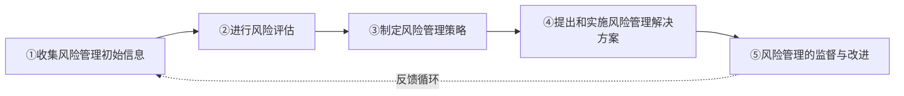
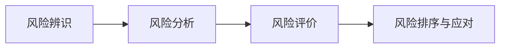

第三节 风险管理基本流程

考情分析：本节内容的出题方式主要以客观题为主，重点考查风险管理基本流程的基本内容，包括

收集风险管理初始信息、

进行风险评估、

制定风险管理策略、

提出和实施风险管理解决方案

以及风险管理的监督与改进

五大基本流程。

学习建议：重在理解并适当记忆本节内容，着重理解相关定义和概念，熟练掌握流程的基本内容，精准掌握风险评估步骤等细节内容。

风险管理的基本流程包括：

①收集风险管理初始信息；

②进行风险评估；

③制定风险管理策略；

④提出和实施风险管理解决方案；

⑤风险管理的监管与改进。如图5-3所示。

图5-3 风险管理基本流程示意图



一、收集风险管理初始信息（**）
A[①收集风险管理初始信息] --> B[②进行风险评估]

B --> C[③制定风险管理策略]
风险管理基本流程的第一步，广泛地、持续不断地收集与本企业风险与风险管理相关的包括历史数据和未来预测在内的内部、外部初始信息，
C --> D[④提出和实施风险管理解决方案]

D --> E[⑤风险管理的监督与改进]
将收集初始信息的职责分工具体地、规范地落实到各有关职能部门和业务单位。
E -.->|反馈循环| A

```
收集初始信息根据以下5种主要风险类型具体展开分析，如表5-7所示。

表5-7 收集5种类型的风险信息

| 风险类型 | 收集信息重点 |
|:--------|:------------|
| **战略风险** | 国内外宏观经济政策、行业政策、技术创新、市场需求、企业战略规划等 |
| **财务风险** | 负债率、现金流、盈利能力、信用评级、汇率利率变动、衍生品交易等 |
| **市场风险** | 产品供需、价格波动、竞争对手、替代品、原材料供应、客户信用等 |
| **运营风险** | 产品结构、新市场开发、质量管理、安全环保、信息系统、员工素质、自然灾害等 |
| **法律风险** | 法律法规变化、合同纠纷、知识产权、合规要求、重大法律诉讼等 |

【例题14·多选题】​（2017年真题）分析企业运营风险，企业应至少收集与该企业、本行业相关的信息，其中包括（ ）​。
| **战略风险** | 国内外宏观经济政策、行业政策、技术创新、市场需求、企业战略规划等 |

| **财务风险** | 负债率、现金流、盈利能力、信用评级、汇率利率变动、衍生品交易等 |
A.企业风险管理的现状和能力
| **市场风险** | 产品供需、价格波动、竞争对手、替代品、原材料供应、客户信用等 |

| **运营风险** | 产品结构、新市场开发、质量管理、安全环保、信息系统、员工素质、自然灾害等 |
B.潜在竞争者、竞争者及其主要产品、替代品情况
| **法律风险** | 法律法规变化、合同纠纷、知识产权、合规要求、重大法律诉讼等 |

C. 期货等衍生产品业务曾发生或易发生失误的流程和环节

D.新市场开发、市场营销策略

【解析】本题考查的是分析运营风险。分析运营风险应关注以下几个方面的内容：​

（1）产品结构、产品研发；​

（2）新市场开发，市场营销策略；​

（3）企业组织效能、管理现状、企业文化，企业员工知识结构、专业经验；​

（4）期货等衍生产品业务发生失误；​

（5）质量、安全、环保、信息安全等管理中发生失误；​

（6）企业内、外部人员的道德风险或业务控制系统失灵；​

（7）给企业造成损失的自然灾害 等风险；​

（8）企业现有业务流程和信息系统的操作、运行、监管、评价及持续改进能力；​

（9）风险管理现状与能力。

故A、C、D选项为正确答案。

二、进行风险评估（***）

（一）风险评估的步骤收集到了风险管理初始信息之后，企业要运用适当的方法对收集的信息以及企业各项业务管理及其重要的业务流程进行风险评估。

风险评估包括风险辨识、风险分析、风险评价3个步骤，如图5-4所示。

图5-4 风险评估步骤



（二）风险评估的方法进行风险辨识、分析、评价，应将定性与定量方法相结合。
graph LR

A[风险辨识] --> B[风险分析]
（1）定性方法。定性方法可采用问卷调查、专家咨询、情景分析、行业标杆比较、政策分析、集体讨论、管理层访谈、由专人主持的工作访谈和调查研究等。
B --> C[风险评价]

C --> D[风险排序与应对]
（2）定量方法。定量方法可采用统计推论（如集中趋势法）​、事件树分析、失效模式与影响分析等。
```

（3）关系分析。分析风险之间的联系，发现风险对冲、风险事件发生的正负抵消组合效应， 从而集中管理风险。

（4）绘制风险坐标图。企业在评估多项风险时，可采用风险坐标图（参见图5-9）​，通过比较各项风险，从高到低绘制风险发生可能性和对目标的影响程度，初步确定对各项风险的管理优先顺序和策略。

（5）聘请中介机构。风险评估应由企业组织有关职能部门和业务单位实施。若职能部门和业务单位不能很好地实施评估工作，也可聘请有资质、信誉好、风险管理专业能力强的中介机构协助实施。

（6）动态、持续评估风险。

【例题15·多选题】收集到了风险管理初始信息之后，企业要运用适当的方法对收集的信息以及企业各项业务管理及其重要的业务流程进行风险评估。以下属于风险评估方法中定性方法的有（ ）​。

A.情景分析 

B.统计推论

C.关系分析 

D.问卷调查

【解析】风险评估的方法包括定性分析、定量分析、关系分析等，其中定性方法可采用问卷调查、专家咨询、情景分析、行业标杆比较、政策分析、集体讨论、管理层访谈、由专人主持的工作访谈和调查研究等，定量方法可采用统计推论（如集中趋势法）​、事件树分析、失效模式与影响分析等。因此，本题风险评估的定性方法应该选择A、D。

【答案】AD

三、制定风险管理策略（***）

（一）定义

风险管理基本流程的第三步是制定风险管理策略。

风险管理策略是企业的一项总体策略，依据自身条件和外部环境，

紧密围绕企业发展战略，有效确定风险偏好、风险承受度、风险管理有效性3项主要标准，

选择风险承担、风险规避等适合的风险管理工具，

并确定风险管理所需人力和财力资源的配置原则。

具体内容见本章第四节。

（二）要点理解

（1）根据不同的风险类型匹配适宜的风险管理策略。

（2）关键环节：根据不同业务特点确定风险偏好和风险承受度。

（3）根据风险与收益相平衡的原则等，确定风险管理的优选顺序，做好资金预算、组织体系、人力资源、应对措施等总体安排。

（4）制定好了风险管理策略之后，要定期总结和分析已制定风险管理策略的合理性和有效性，不断修订、完善。

四、提出和实施风险管理解决方案（***）

在制定好风险管理策略后，为进一步落实风险管理工作，企业必须根据风险管理策略，针对各类风险或每一项重大风险制定相应的风险管理解决方案。

（一）风险管理解决方案的两种类型从大的分类看，风险管理解决方案可以分为外部和内部解决方案。

1.外部解决方案

外部解决方案一般指外包。

企业可以将风险管理工作外包给专业的投资银行等机构，提高效率。但是也要注重外包的质量、成本与收益的平衡，避免产生过度依赖等风险，并制定相应的预防和控制措施。

2.内部解决方案

内部解决方案是风险管理体系的运转。一般综合应用

风险管理策略、

组织职能、

信息系统（包括报告体系）​、

内部控制（包括政策、制度、程序）

和风险理财措施等多种手段，

尤其是在满足合规要求、保持战略的一致性等前提下建立有效的内部控制。

（1）内部控制概念：内部控制是全面风险管理的重要组成部分，是通过设计和实施一系列的企业流程政策、制度、程序以及措施等，以达到控制影响实现流程目标的各种风险的过程。

（2）制定内部控制的措施，一般包括下述内容。

①建立内控岗位授权制度。包括明确授权对象、条件、范围、额度等的制定。

②建立内控报告制度。包括明确报告时间、人员、内容、频率、传递路线等。

③建立内控批准制度。包括明确批准程序、条件、范围、必备文件、相应部门、人员安排等。

④建立内控责任制度。明确部门、业务单位、岗位、人员等的责任归属及奖惩制度。

⑤建立内控审计检查制度。明确检查对象、内容、方式以及检查部门等。

⑥建立内控考核评价制度。可以将风险管理执行情况与绩效薪酬挂钩。

⑦建立重大风险预警制度。加强对重大风险的检测，及时发布预警信息，制定相应的应急预案。

⑧建立健全企业法律顾问制度。以总法律顾问制度为核心，加强企业法律风险的防范机制建设，形成全员参与的法律风险责任体系，完善重大法律纠纷案件的备案管理制度。

⑨建立重要岗位权力制衡制度，实行不相容岗位分离制度。对于授权批准、业务经办、会计记录以及稽核检查、财产保护等职责实行岗位分离。更多的有关内部控制的内容，可参考第6章。

（二）关键风险指标管理

关键风险指标管理是指对引起风险事件发生的关键成因指标进行相应管理的方法，既可以管理单项风险的多个关键成因，同时也可以管理影响企业主要目标的多个主要风险。

1.关键风险指标管理的步骤关键风险指标管理的步骤一般分为以下6步。

①分析风险成因，从中找出关键成因。

②量化关键成因，分析确定导致风险事件发生时该成因的具体数值。

③以该具体数值为基础，以发出风险信息为目的，加上或减去一定数值后形成新的数值，即为关键风险指标。

④建立风险预警系统，当关键成因数值达到关键风险指标时，立即发出风险预警信息。

⑤提前制定出现风险预警信息时应采取的风险控制措施。

⑥时刻跟踪关键成因数值的变化，一旦出现预警，立即实施风险控制措施。

2.关键风险指标分解

企业目标的实现离不开各个职能部门和业务单位共同的努力，

因此要兼顾各职能部门和业务单位的诉求，

在协调各职能部门与业务部分的基础上，

将关键风险指标分解至具体部门。

从而把企业整体风险控制在一定范围内。

3.落实风险管理解决方案

（1）高度重视，要认识到风险管理是企业时刻不可放松的工作，是企业价值创造的根本源泉。

（2）风险管理是企业全员的分内工作，没有风险的岗位是不能创造价值的岗位，没有理由存在的岗位。

（3）落实到组织，明确分工和责任，全员进行风险管理。

（4）为确保工作的效果，落实到位，要对风险管理解决方案的实施进行持续监控改进，并与绩效考核联系起来。

五、风险管理的监督与改进（**）

风险管理活动是一项持续性的过程，以重大风险、重大事件、重大决策、重要管理及业务流程为重点，

监督以上风险管理初始信息、风险评估、风险管理策略、风险管理解决方案、关键控制活动的实施情况，

运用压力测试、返回测试、穿行测试以及风险控制自我评估等方法检验风险管理的有效性，

根据变化情况和存在的缺陷及时加以改进。

企业应建立全面的、有效的信息沟通渠道，确保信息沟通的及时性、准确性、完整性，为风险管理的监督和改进奠定基础。

（1）企业各有关部门和业务单位应定期对风险管理工作进行自查和检验，及时发现缺陷并改进，其检查、检验报告应及时报送企业风险管理部门。

（2）风险管理职能部门应定期对各部门和业务单位风险管理工作实施情况和有效性进行检查和检验，要根据在制定风险策略时提出的有效性标准的要求对风险管理策略进行评估，

对跨部门和业务单位的风险管理解决方案进行评价，提出调整或改进建议，出具评价与建议报告，及时报送企业总经理或其委托分管风险管理工作的高级管理人员。

（3）内审部门应至少每年一次监督评价各部门能否按照有关规定开展风险管理工作及其工作效果，向董事会或董事会下设的风险管理委员会和审计委员会直接报送监督评价报告。

（4）外包聘请的中介机构出具的风险管理评估和建议专项报告一般应涉及以下几部分的实施情况、缺陷内容，并相应提出修改建议。

①风险管理基本流程、风险管理策略。

②重大风险、重大事件以及重要管理及业务流程的风险管理及内部控制系统的建设。

③风险管理组织体系、信息系统。

④全面风险管理总体目标。

【例题16·单选题】下列关于风险管理的描述中，错误的是（ ）​。

A. 风险管理基本流程的最后一步是风险管理的监督与改进

B. 企业内审部门应至少每3年一次对风险管理工作及其工作效果进行监督评价

C. 风险管理职能部门定期检查和检验风险管理工作实施情况，评估风险管理策略，评价风险管理解决方案，提出调整或改进建议

D. 企业应该建立全面的、有效的信息沟通渠道，确保信息沟通的及时性、准确性、完整性

【解析】内审部门应至少每年一次监督评价各部门、各业务能否按照有关规定开展风险管理工作及其工作效果，并向董事会或董事会下设的风险管理委员会和审计委员会直接报送监督评价报告。故B选项的说法错误。

【答案】B

名师点拨

考生一定要注意教材的细节，尤其是数字和一些基本的观点，是常考的内容。

【例题17·多选题】在风险管理监督与改进的过程中，企业可以采取（ ）方法检验风险管理的有效性，根据变化情况和存在的缺陷及时对风险管理方式、方法等加以改进。

A.顺向测试 

B.穿行测试

C.压力测试 

D.返回测试

【解析】风险管理活动是一项持续性的过程，以重大风险、重大事件、重大决策、重要管理及业务流程为重点，

监督以上风险管理初始信息、风险评估、风险管理策略、风险管理解决方案、关键控制活动的实施情况，

运用压力测试、返回测试、穿行测试以及风险控制自我评估等方法检验风险管理的有效性，根据变化情况和存在的缺陷及时加以改进。

故本题选择B、C、D。

【答案】BCD