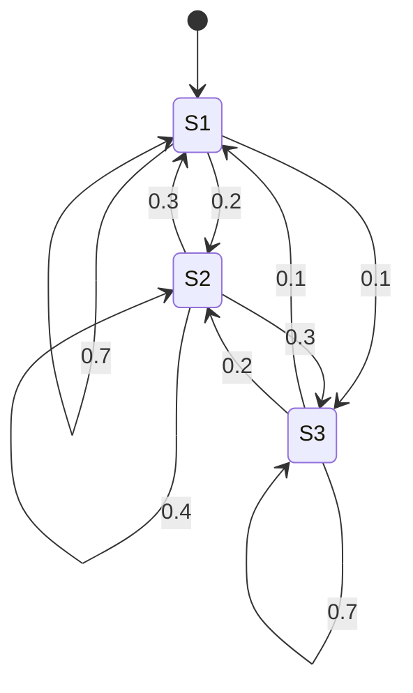
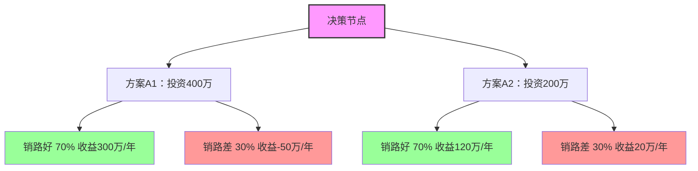
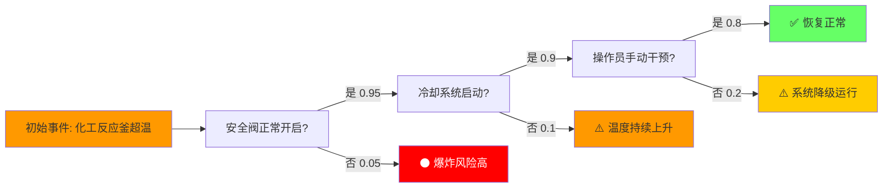

第五节 风险管理技术与方法

考情分析：本节内容的出题方式既涉及客观题也涉及主观题，但主要以客观题为主。

本节重要考点为：11种风险管理技术方法（见表5-19）的名称、适用范围、实施步骤、主要优点与局限性等内容。

学习建议：本节内容重在理解并适当记忆，了解各分析方法的实施步骤，对比掌握各分析方法的优缺点，注意德尔菲法、流程图分析法、风险评估系图法的适用范围。

表5-19 风险管理技术与方法


| 序号 | 方法名称 | 适用范围关键词 | 适用场景举例 |
|:----:|:--------|:--------------|:-----------|
| 1 | **头脑风暴法** | 集体讨论、畅所欲言、创新思路 | 新产品风险评估、战略方向不确定性分析 |
| 2 | **德尔菲法** | 专家匿名、多轮征询、共识 | 长期技术趋势预测、复杂系统风险识别 |
| 3 | **失效模式影响和危害度分析法** | 系统性失效、流程分析、故障后果 | 生产设备故障分析、化工流程风险评估 |
| 4 | **风险评估系图法** | 可视化、坐标图、优先排序 | 多风险对比、资源优先分配决策 |
| 5 | **马尔可夫分析法** | 状态转移、概率预测、动态系统 | 设备状态预测、信用评级迁移、客户流失分析 |
| 6 | **敏感性分析法** | 单因素变化、关键变量、边界测试 | 项目投资回报分析、成本弹性分析 |
| 7 | **决策树法** | 多方案比较、概率分支、决策节点 | 投资方案选择、产品开发决策 |
| 8 | **统计推论法** | 历史数据、趋势外推、大数定律 | 保险精算、风险频率预测、经济周期分析 |
| 9 | **事件树分析法** | 初始事件→后续事件链 | 安全事故因果链、火灾蔓延路径分析 |
| 10 | **情景分析法** | 未来情景假设、多情景对比 | 宏观经济情境模拟、政策变化影响评估 |
| 11 | **基准分析法** | 对标比较、行业标杆、差距识别 | 行业最佳实践对标、竞争对手分析 |
一、头脑风暴法（**）

头脑风暴法又称自由思考法、BS法、智力激励法，是通过集体讨论等形式，刺激并鼓励一群知识渊博、知悉风险情况的人员畅所欲言的一种方法，具体分为直接头脑风暴法和质疑头脑风暴法两类。

前者是通过专家群体决策，尽可能正向激发创造性而产生想法；

后者是逆向思维，对已提出的设想、方案等质疑，从而产生新的想法。

（一）适用范围适用于充分发挥专家意见，在风险识别阶段进行定性分析。

（二）实施步骤

（1）会前准备讨论主题等内容。

（2）会中展开风险主题探讨。

（3）会后风险主题探讨意见分类及整理。

（三）主要优点及局限性

头脑风暴法的主要优点及局限性，如表5-20所示。

表5-20 头脑风暴法主要优点及局限性


| 维度 | 内容 |
|:----|:----|
| **优点** | ①激发创造力，有助于发现新风险和新解决方案；②增强参与感，全员参与，集思广益；③简单易行，不需高级统计工具 |
| **局限性** | ①可能受权威影响，少数人主导讨论；②易产生从众效应，压抑不同意见；③结果受参与者知识水平限制；④不适合需深度定量分析的复杂风险 |
【例题35·多选题】头脑风暴法又称自由思考法、BS法、智力激励法，下列选项中，属于头脑风暴法优点的有（ ）​。

A.清晰明了，易于操作

B.速度较快并易于开展

C.有助于发现新的风险和全新的解决方案

D.形式相对松散，较难保证过程的全面性

【解析】头脑风暴法的主要优点如下。

①激发想象力，利于发现新的风险和全新的解决方案。

②多方参与，有助于所有利益相关者的全面沟通。

③易于开展，速度较快。因此选项B和C正确，D选项属于头脑风暴法的缺点，而A选项属于流程图分析法的优点。

【答案】BC

二、德尔菲法（**）

德尔菲法又名专家意见法，是在匿名发表意见方式的前提下，通过反复征询和反馈专家意见，使意见趋于集中，最终获得高准确率的集体判断结果的一种方法。

（一）适用范围

适用于在专家一致性意见基础上，在风险识别阶段进行定性分析。

（二）实施步骤

（1）成立专家小组。

（2）向专家提出问题及要求。

（3）专家根据资料与要求，提出自己的意见。

（4）汇总专家意见再分发给专家以修改。

（5）汇总修改意见再分发。

（6）综合处理专家意见。

（三）主要优点和局限性

德尔菲法的主要优点和局限性，如表5-21所示。

表5-21 德尔菲法的主要优点及局限性


| 维度 | 内容 |
|:----|:----|
| **优点** | ①匿名性避免权威影响；②多轮征询逐步收敛；③结果相对客观，代表专家群体共识；④不受地域限制 |
| **局限性** | ①耗时长，多轮征询进度慢；②专家选择直接影响结果质量；③无法处理突发性/前所未见的风险；④结果受主观判断影响 |
（四）案例

案例背景：欣欣学校校长准备将学校的饮食服务外包给外部的服务供应商，由其接管现有的食堂员工、厨师并对饮食安全等负责。

为此，学校委托一家专业公司进行调查，该公司采用德尔菲法对相关风险因素进行了分析。

实施步骤如下。

（1）组织30名相关领域专家共同探讨。

（2）提出风险因素：包括承包商的财务结构不稳定；承包商的卫生标准、在为学生提供服务、饮食方面有不良记录；学校无法控制绩效；公众对于饮食外包的敌对情绪；食品卫生情况与学生生病及感染病症等之间的关联关系。

（3）针对风险因素编制20个问题。

（4）反复征询专家意见。

（5）最终达成共识。

【例题36·单选题】​（2016年真题）甲公司是一家计划向移动互联网领域转型的大型传统媒体企业。为了更好地了解企业转型中存在的风险因素，甲公司聘请了20位相关领域的专家，根据甲公司面临的内外部环境，针对六个方面的风险因素，反复征询每个专家的意见，直到每一个专家不再改变自己的意见，达成共识为止。该种风险管理方法是（ ）​。

A.德尔菲法 

B.情景分析法

C.头脑风暴法 

D.因素分析法

【解析】本题考查的是德尔菲法。

德尔菲法（Delphi Method）​，又称专家规定程序调查法。

该方法主要是由调查者拟定调查表，按照既定程序，以函件的方式分别向专家组成员进行征询；

而专家组成员又以匿名的方式（函件）提交意见。

经过几次反复征询和反馈，专家组成员的意见逐步趋于集中，最后获得具有很高准确率的集体判断结果。

【答案】A

三、流程图分析法（**）

流程图分析法是通过调查与分析流程的每一阶段、每一环节，发现潜在风险以及导致风险发生的因素的目的，最终分析得出风险产生后可能造成的损失以及对整个组织可能造成的不利影响的一种方法。

（一）适用范围

运用流程图分析，对企业生产或经营中的风险及其成因进行定性分析。

（二）实施步骤

（1）绘制流程图。

（2）识别业务节点上的风险因素。

（3）针对风险及成因，提出监控与预防的方法。

（三）主要优点和局限性

（1）主要优点：清晰明了，易于操作，尤其是针对于业务较多的大型企业，运用流程图分析，能够更好地发现风险点，从而为防范风险提供支持。

（2）局限性：实施效果依赖于专业人员的水平。

（四）案例

在某经济开发集团建立了详细地财务费用报销制度，从中可以看出整个财务费用报销流程中的各个环节的风险点及权责部门，如表5-22所示。

表5-22 财务费用报销流程风险分析


| 流程环节 | 风险描述 | 权责部门 |
|:--------|:--------|:--------|
| 报销申请 | 虚假报销、超标准报销 | 各业务部门（申请人） |
| 部门审核 | 审核不严、人情审批 | 各部门负责人 |
| 财务初审 | 票据不合规、预算超支未发现 | 财务部 |
| 财务复审 | 重复报销、跨期费用错配 | 财务部（复核岗） |
| 领导审批 | 违规审批、越权审批 | 分管领导/总经理 |
| 出纳付款 | 支付错误、超期未付 | 出纳 |
四、风险评估系图法（**）

风险评估系图主要是通过制作风险评估系图来识别某一风险是否会对企业产生重大影响，同时结合风险发生的可能性，为确定企业风险的优先次序提供框架。

风险评估系图法是最简单的一种定性方法，因此要注意相关客观题的考查。

（一）适用范围

适用于对风险初步的定性分析。通过业务流程图方法，对企业生产或经营中的风险及其成因进行定性分析。

（二）实施步骤

1.绘制风险

评估系图如图5-9所示，横轴代表的是风险发生的可能性，纵轴代表的是风险对企业可能产生的影响程度，X1和X2代表的是识别出的两项风险。

图5-9 风险评估系图

```mermaid
quadrantChart
  title 风险评估系图
  x-axis "可能性(低→高)"
  y-axis "影响程度(低→高)"
  quadrant-1 "重大风险（优先处理）"
  quadrant-3 "一般风险（监控）"
  "X1": [0.75; 0.75]
  "X2": [0.25; 0.25]
```

2.风险分析

分析风险的重大程度与影响，确立风险的优先秩序。如图5-9所示，由于风险X1发生的可能性与影响程度均比风险X2更高，因此要优先应对风险X1，其次应对风险X2。

（三）主要优点及局限性

（1）主要优点：简单的定性方法，直观明了。

（2）局限性：不能进一步探求风险原因，缺乏经验证明和数据支持。

【例题37·单选题】在风险评估系图中，风险对企业所产生的影响是风险评级的重要参数，另一个影响风险评级的重要参数是（ ）​。

A.应对风险措施的成本

B.风险发生的可能性

C.企业对风险的偏好

D.企业对风险的承受能力

【解析】本题考查的是风险评估系图的基本概念。如图5-9所示，绘制风险评估系图时，横轴表示的是风险发生的可能性，纵轴表示的是风险产生的影响，因此选择B。

【答案】B

【例题38·单选题】乙公司为一家专营空中物流货运的航空公司，现正为可能开发的中东航线进行风险评估。图5-10是所制定的风险评估系图。

图5-10 乙公司风险评估系图


```mermaid
quadrantChart
  title 乙公司风险评估系图（中东航线）
  x-axis "可能性(低→高)"
  y-axis "影响程度(低→高)"
  quadrant-1 "应对"
  quadrant-3 "监控"
  "风险①": [0.8; 0.7]
  "风险②": [0.7; 0.2]
  "风险③": [0.3; 0.6]
  "风险④": [0.2; 0.2]
```

*注：乙公司中东航线的4个风险——风险①（高可能+高影响，优先应对），风险④（低可能+低影响，最低优先级）*
在风险管理的基本原则下，乙公司应将注意力集中应对所面临的风险有（ ）​。

A.风险①和风险②

B.风险①、风险②和风险③

C.风险①、风险②和风险④

D.风险①、风险②、风险③和风险④

【解析】风险评估系图法主要是通过制作风险评估系图来识别某一风险是否会对企业产生重大影响，同时结合风险发生的可能性，为确定企业风险的优先次序提供框架，从而优先应对风险性较大且发生的可能性较强的风险。本题中，风险①和风险②处于第一象限，属于风险发生的可能性和影响都比较大的风险，风险③虽然影响大，但发生的可能性不高，风险④虽然发生的可能性高，但影响不大，因此，乙公司应将注意力集中应对风险①和风险②。故选择A。

【答案】A

【例题39·多选题】风险管理的技术与方法多种多样，下列选项中属于定性的风险管理技术和方法的有（ ）​。

A. 头脑风暴法 

B. 德尔菲法

C. 流程图分析法 

D. 风险评估系图法

【解析】风险管理技术方法中的定性方法主要有头脑风暴法、德尔菲法、流程图分析法、风险评估系图法4种，因此选项A、B、C、D均正确。

【答案】ABCD

五、马尔可夫分析法（**）

马尔可夫分析法是指在马尔可夫过程的假设前提下，在分析随机变量的现时变化情况的基础上，预测其未来变化情况的一种预测方法。

（一）适用范围

适用于对复杂系统中不确定性事件及其状态改变的定量分析。

（二）实施步骤

（1）调查不确定性事件各状态及其变化情况。

（2）建立数学模型。

（3）求解模型，得到风险事件各个状态发生的可能性。

（三）主要优点和局限性

马尔可夫分析法的主要优点及局限性如表5-23所示。

表5-23 马尔可夫分析法的主要优点及局限性


| 维度 | 内容 |
|:----|:----|
| **优点** | ①能处理多状态、动态系统的概率预测；②直观显示状态间的转移规律；③可用于预测系统长期稳定性 |
| **局限性** | ①假设未来状态只依赖于当前状态（无记忆性），现实中不完全成立；②需要大量历史数据估计转移概率；③不适合突发事件和非稳态系统 |
（四）案例

假设一个复杂系统存在3种状态，S1代表功能正常，S2代表功能降级，S3代表故障。

系统每天都会存在于上述3种状态中的一种，因此今、明两天结合发生的概率图如下列马尔可夫矩阵所示，具体概率分布如表5-24所示。

表5-24 马尔可夫矩阵矩阵


| 今日\明日 | S1（功能正常） | S2（功能降级） | S3（故障） |
|:---------:|:-------------:|:-------------:|:---------:|
| **S1（功能正常）** | 0.7 | 0.2 | 0.1 |
| **S2（功能降级）** | 0.3 | 0.4 | 0.3 |
| **S3（故障）** | 0.1 | 0.2 | 0.7 |

*注：每行数值之和为1，代表系统从该状态转移到各可能状态的概率分布。如S1→S1概率70%，S1→S2概率20%，S1→S3概率10%。*
每列数值之和为1，代表的是每种情况的一切可能结果的总和。

这个系统也可以采用马尔可夫图来表示，其中圆圈代表的是状态，概率的转移用箭头表示，具体如图5-11所示。

图5-11 马尔可夫系统图



用Pi代表系统所处状态i（i为1、2或3）​，则可以根据表5-24的相互关系

建立方程组：

P1=0.95P1+0.3P2+0.2P3 （1）

P2=0.04P1+0.65P2+0.6P3 （2）

P3=0.01P1+0.05P2+0.2P3 （3）

P1+P2+P3=1 （4）

通过求解上述方程组，得到P1=0.85，P2=0.13，P3=0.02，说明系统充分发挥功效的可能为85%，处于降级状态的为13%，而存在故障的可能为2%。

六、敏感性分析法（**）

敏感性分析是针对潜在的风险性，在确定性分析的基础上，进一步研究项目的各种不确定因素变化对其主要经济指标的变化率及敏感程度影响大小的一种方法。

如果不确定性因素的小幅度变化引起主要指标的较大变化，则称此因素为敏感性因素。

该分析从改变可能影响分析结果的不同因素的数值入手，估计结果对这些变量的变动的敏感程度。

找到敏感性因素后，还可以进一步分析其成因等，进而控制分析。

敏感性分析最常用的显示方式是龙卷风图。

（一）适用范围

适用于对项目的不确定性对于结果产生的影响进行的定量分析。

（二）实施步骤

（1）选定不确定因素，并设定变动范围。

（2）确定分析的主要指标。

（3）进行敏感性分析，即计算不确定因素变动对主要指标变动的影响。

（4）绘制敏感性分析图，用图的形式将上述结果体现出来。

（5）确定变化的临界点。

（三）主要优点和局限

敏感性分析法的主要优点及局限性，如表5-25所示。

表5-25 敏感性分析法的主要优点及局限性


| 维度 | 内容 |
|:----|:----|
| **优点** | ①简单直观，识别关键变量；②为决策者提供敏感度边界信息；③有助于判断项目风险承受能力 |
| **局限性** | ①只考虑单因素变化，忽略多因素交互影响；②未考虑各因素变化概率，可能高估/低估风险；③无法处理非线性和路径依赖问题 |
（四）案例

欣欣公司是一家大型上市公司，最近准备投资一个化纤项目，因此重点关注该项目的内部收益率。其中影响项目收益率的主要有投资额的大小、经营成本以及销售收入的高低，并且由于这3个因素都不是企业能够控制的，于是将其作为敏感性分析的对象。相应地根据预计的现金流量表数据，该公司计算出了各因素的数值变化对于内部收益率变化的比例，然后描绘出敏感性分析图，发现最为敏感的因素，并且依据企业要求的最低报酬率计算各要素的临界值，进而为作出决策提供依据。

【例题40·单选题】​（2015年真题）甲公司拟新建一个化工项目。经过可行性研究，该项目预计净现值为420万元，内部收益率为13%。甲公司进一步分析初始投资，建设期及寿命期的变动对该项目预计净现值的影响及影响程度。甲公司风险管理技术与方法是（ ）​。

A.事件树分析法 

B.敏感性分析法

C.决策树分析法 

D.情景分析法

【解析】 事件树分析法是一种表示初始事件发生之后互斥性后果的图解技术，其根据是为减轻其后果而设计的各种系统是否起作用，故选项A错误。

敏感性分析是针对潜在的风险性，研究项目的各种不确定因素变化至一定幅度时，计算其主要经济指标变化率及敏感程度的一种方法。

敏感性分析是在确定性分析的基础上，进一步分析不确定性因素对项目最终效果指标的影响及影响程度。

敏感性因素一般可选择主要参数（如销售收入、经营成本、生产能力、初始投资、寿命期、建设期、达产期等）进行分析。因此，故选项B正确。

决策树分析法是考虑到在不确定性的情况下，以序列方式表示决策选择和结果，故选项C错误。

情景分析法可以用来预计威胁和机遇可能发生的方式，以及如何将威胁和机遇用于各类长期和短期的风险，故选项D错误。

【答案】B

七、决策树法（**）

决策树是利用概率论的原理，在考虑到不确定性情况下，运用序列的形式来表示决策选择和结果。其方法简便，而且适合在题目中考查。

因此，考生要注意理解决策树的决策方法，并且可以将其运用至具体的案例中。

（一）适用范围

适用于对不确定性投资方案期望收益的定量分析。

（二）实施步骤

如图5-12所示。决策树中方块代表决策节点，每一条分枝就代表一个方案。分枝数就是可能的方案数。

圆圈代表方案的节点，引出概率分支。圆圈代表方案的节点，从它引出的每条概率分枝标明了状态及其发生的概率。

根据右端的损益值和概率，计算出期望值。确定期望结果的选择。

（三）案例

如图5-12所示，A1和A2方案，假设其投资分别为400万元和200万元，经营的年限均为5年。假设销路好的概率和销路差的概率分别为70%和30%，A1方案销路好的收益为300万元，销路差时就亏损100万元，而A2方案销路好的收益为100万元，销路差的收益为50万元。则A1方案的收益=（300×0.7-100×0.3）×5-400= 500（万元）A2方案的收益=（100×0.7+50×0.3）×5-200= 225（万元）

图5-12 决策树示例




*决策树解读：方案A1期望值=5×(0.7×300万+0.3×(-50万))-400万=5×195万-400万=575万；方案A2期望值=5×(0.7×120万+0.3×20万)-200万=5×90万-200万=250万。方案A1更优。*
（四）主要优点和局限性

1.主要优点

（1）能清楚地用图解说明细节。

（2）可以计算出到达一种情形的最优路径。

2.局限性

（1）有些决策树过于复杂，不容易与其他人交流。

（2）树形图有过于简化环境的倾向，考虑不全面。

【例题41·单选题】某公司财务部使用净现值法评价一个投资项目。根据公司发展战略有很多影响投资的变量，其中多个变量是不确定的。一些变量的值可能会取决于其他变量的值，因此该方法列出各个不确定变量及其结果以便衡量替代行为的范围与可能的结果。根据描述选择这种财务风险管理技术是（ ）​。

A.净现值法

B.敏感性分析法

C.决策树法

D.决策矩阵法

【解析】净现值法属于财务管理中探讨投资决策的一种方法，而非财务风险管理技术方法，决策矩阵法也不是基本的风险管理技术方法，而选项B、C则均属于风险管理技术方法。

敏感性分析法是探讨一因素的变化对主要指标变化的影响，因此不是本题目的答案。采用排除法就应该选择C。

并且，决策树法是利用概率论的原理，在考虑到不确定性情况下，运用序列的形式来表示决策选择和结果。决策树中方块代表决策点，

每一条树枝代表一个方案，其后续的变量值取决于前面变量的值，因此本题答案为C。

【答案】C

【例题42·多选题】下列有关决策树的说法中，正确的有（ ）​。

A. 决策树适用于对不确定性投资方案期望收益的定量分析

B. 有些决策树过于复杂，不容易与其他人交流

C. 决策树可以计算到达一种情形的最优路径

D. 决策树中的树形图有过于简化环境的倾向，可能会导致考虑不全面

【解析】决策树是利用概率论的原理，在考虑到不确定性情况下，运用序列的形式来表示决策选择和结果，适用于对不确定性投资方案期望收益的定量分析。

决策树的优点为：①清楚地用图解说明细节；②可以计算到达一种情形的最优路径。

其局限性为：①有些决策树过于复杂，不容易与其他人交流；②树形图有过于简化环境的倾向，考虑不全面。故选择A、B、C、D。

【答案】ABCD

八、统计推论法（**）

统计推论法是进行项目风险评估和分析的一种十分有效的方法，是通过分析现有数据或未知事件等进而推断得出结论的一种方法。

（一）类型

（1）前推：根据历史的经验和数据向前推断出未来事件发生的概率及其后果。

（2）后推：在没有历史数据的情况下，把未知的、想象的事件与一已知事件结合起来，尽量收集已有的数据，从而对风险做出评估和分析。

（3）旁推法：就是利用历史记录对类似新建项目的数据进行相关性地外推。

（二）适用范围

统计推论法适合于各种风险分析预测。

（三）实施步骤

（1）收集整理历史数据。

（2）选择合适的评估指标并给出数学模型。

（3）预测风险发生的可能性及损失大小。

（四）主要优点和局限性

（1）主要优点：若数据充足可靠，此方法简单易行，结果准确率高。

（2）局限性：若前提和环境发生变化，结果则不一定适用；没有考虑事件的因果关系，使外推结果可能产生较大偏差。

【例题43·单选题】​（2017年真题）甲公司是一家大型商场。开业以来，公司积累了丰富的销售数据。公司战略部门每年都会对这些数据进行收集整理，据此推算出未来年度企业的销售风险。根据上述信息，甲公司采用的风险管理方法是（ ）​。

A.后推法

B.前推法

C.逆推法

D.正推法

【解析】本题考查的是统计推论法。前推法是从历史的经验和数据出发，向前推测未来事件可能发生的概率及后果，是采用最普遍而又行之有效的一种预测方法。

题干中根据积累的销售数据推算未来年度企业的销售风险，就是根据以往的历史数据来推测的，此方法属于前推法，故B选项为正确答案。

【答案】B

九、失效模式影响和危害度分析法（**）

失效模式影响及危害度分析法，就是通过对系统各部件的每一种可能潜在的故障模式进行分析，找出故障原因，分类并分析，进而提出预防和纠正措施的方法，

具体分为故障模式分析、故障影响分析和故障后果分析3类。

（一）适用范围

失效模式影响和危害度分析法适用于对失效模式、影响及危害进行定性或定量分析，对于其他风险识别方法而言还可为之提供数据支持。

（二）实施步骤

（1）将系统分为组件或步骤，并进行相关的失效分析。

（2）结合故障的严重性，确定风险等级。

（3）识别风险的优先级。

（4）输出总体清单。

（三）主要优点和局限性失效模式影响和危害度分析法的优点及局限性，如表5-26所示。

表5-26 失效模式影响和危害度分析法的主要优点及局限性


| 维度 | 内容 |
|:----|:----|
| **优点** | ①系统性强，从底层失效逐层分析到系统级影响；②可量化风险优先级（RPN值）；③早期发现设计缺陷，降低整改成本 |
| **局限性** | ①耗时耗力，大型系统分析工作量巨大；②分析质量依赖专家经验；③对多故障同时发生的复杂场景不易处理；④可能导致过于保守的设计 |
十、情景分析法（**）

情景分析法是通过分析特定的情景，识别出此情景下可能发生的事件及其潜在的结果，进而采取相应的对应措施的一种方法。

情景分析既依靠现有的数据，同时在数据不充分的情况下，还依靠人们的想象力。

（一）适用范围情景分析法通过模拟和分析不确定性情景，对企业面临的风险进行定性和定量分析。

（二）分析对象情景分析法中关键是要分析变化的因素，如外部环境、宏观环境、今后的决策、利益相关者的需求等因素的变化对于情景结果的影响。

（三）主要优点及局限性

（1）主要优点：若未来情况变化不大，结果则比较准确。

（2）局限性：不确定性越大，情景分析结果则无意义；受限于数据有效性及情景分析师的能力；情景分析可能靠想象决策，缺乏充分的基础。

十一、事件树分析法（**）

事件树分析法是在决策树分析法的基础上建立起的一种定性与定量结合的方法。

图5-13所示是一种典型的事件树示例。其建立在初始事件之上，并有相应概率发生的不同结果。

图5-13 事件树分析图示例




*事件树解读：初始「反应釜超温」后经过3道安全屏障（安全阀/冷却/人工干预），最终概率：✅恢复正常=0.95×0.9×0.8=0.684；⚠️系统降级=0.95×0.9×0.2=0.171；⚠️温度上升=0.95×0.1=0.095；⚫爆炸风险=0.05*
（一）适用范围事件树分析法适用于对故障发生以后，考虑各种可减轻事件严重性影响的事件，对多种可能后果的定性和定量分析。

（二）主要优点和局限性

（1）主要优点：图示清晰显示了各种情景；体现了时机、依赖性以及故障树模型中很烦琐的多米诺效应；可以体现事件的顺序。

（2）局限性：需要识别所有的初始事项；不能将恢复事项纳入其中；后续事项的发生取决于以前支点事项。

【例题44·单选题】下列分析方法中，属于定性分析与定量分析结合的方法是（ ）​。

A.流程图分析法 

B.德尔菲法

C.决策树法 

D.事件树分析法

【解析】定性与定量结合的分析方法有失效模式影响和危害度分析法、情景分析法和事件树分析法，

选项A和选项B属于定性分析方法，选项C属于定量分析方法，只有选项D是定性与定量结合的风险管理技术与方法。故选择D。

【答案】D