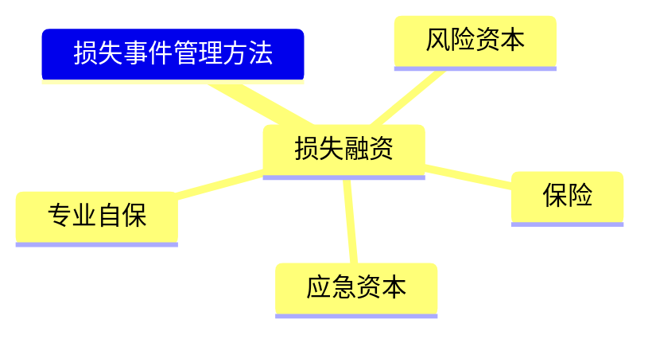

第四节 风险管理体系

考情分析：本节内容出题方式既涉及客观题也涉及主观题，重点考查五大风险管理体系的相关内容，包括

风险管理策略的作用、

风险管理策略的工具、

风险管理组织体系、

内部控制系统、

风险理财措施、

风险管理信息系统等。

学习建议：本章是主观题的常考内容，考试需理解并记忆本节内容，着重理解相关定义和概念，尤其是风险管理策略的相关概念，熟练掌握风险管理策略总体定位、风险理财措施，精准掌握7种风险管理策略的工具的类别、定义及适用情况等。

企业管理体系包括五大体系：

①风险管理策略；②风险理财措施；③风险管理的组织职能体系；④风险管理信息系统；⑤内部控制系统。

一、风险管理策略（**）

风险管理策略是企业的一项总体策略，依据自身条件和外部环境，紧密围绕企业发展战略，

有效确定风险偏好、风险承受度、风险管理有效性3项主要标准，

选择风险承担、风险规避等适合的风险管理工具，并确定风险管理所需人力和财力资源的配置原则。

（一）风险管理策略的定位

（1）风险管理策略作为全面风险管理的总体策略，其制定依据为企业经营战略。

（2）在整个风险管理体系中，风险管理策略起着统领全局的作用。

（3）在企业战略管理的过程中，风险管理策略承上启下，与企业战略紧密联系，保持一致，减少了企业战略错误的可能性。

（二）风险管理策略的作用

（1）服务于企业的总体战略，保证企业经营目标的实现。

（2）在企业的整体经营战略和运营活动中起连接作用。

（3）指导企业所有风险管理活动。

（4）分解为具体的各领域的风险管理指导方针。

（三）风险管理策略的组成部分

（1）风险偏好和风险承受度。明确公司是否承担风险，承担什么风险，承担多少风险。

（2）全面风险管理的有效性标准。确立标准以衡量风险管理工作的成效。

（3）风险管理的工具选择。明确管理风险的方式、方法。

（4）全面风险管理的资源配置。明确人力、财力、物资、外部资源等重要风险管理资源的合理安排。

【例题18·多选题】风险管理策略是企业的一项总体策略，以下选项中属于风险管理策略的组成部分的有（ ）​。

A.全面风险管理的有效性标准

B.风险偏好和风险承受度

C.全面风险管理的资源配置

D.风险管理的工具选择

【解析】风险管理策略是企业的一项总体策略，依据自身条件和外部环境，紧密围绕企业发展战略，有效确定风险偏好、风险承受度、风险管理有效性3项主要标准，

选择风险承担、风险规避等适合的风险管理工具，并确定风险管理所需人力和财力资源的配置原则。因此以上4个选项，都属于风险管理策略的范围。

【答案】ABCD

（四）风险管理策略的工具

7种风险管理策略工具包括：风险承担、风险规避、风险转移、风险转换、风险对冲、风险补偿、风险控制，其含义和内容如表5-8所示。

表5-8 7种风险管理策略工具

| 策略工具 | 含义 | 核心要点 |
|:--------|:----|:---------|
| **风险承担** | 企业主动承担风险，不采取规避措施 | 亦称'风险自留'，适用于对风险无计可施或预期损失很小时 |
| **风险规避** | 回避风险源、放弃或停止相关业务 | 彻底消除风险，但也放弃了收益机会 |
| **风险转移** | 将风险转移给他人承担（不消除） | 典型方式：保险、非保险型转移（合同/外包） |
| **风险转换** | 减少某风险的同时增加另一风险 | 典型的战略调整手段 |
| **风险对冲** | 采取多种资产/操作组合来抵消风险损失 | 如多币种经营、资产组合 |
| **风险补偿** | 以价格/利率补偿承担的风险 | 如坏账准备、风险溢价 |
| **风险控制** | 控制触发风险的条件，降低损失概率或程度 | 传统风控核心，分为预防性&抑制性控制 |


7种风险管理工具侧重点各不相同，各有特点，如图5-5所示。

传统风险应对策略注重风险降低与风险预防，因此常用的是风险承担、风险转换、风险规避、风险控制等方法，而全面风险管理则根据不同情况采取最为适宜的方法。

同样，针对不同种类的风险，一般也会采用不同的方法，如对于战略、财务法律和运营等方面的风险，更适宜用风险承担、风险转换、风险规避、风险控制，

而对于运用了保险、对冲、期货等金融手段的理财风险，则更适宜用风险转移、风险对冲、风险补偿等方法。

图5-5 7种风险工具对比

```mermaid
mindmap
  7种风险管理工具
    风险承担
      [子主题] 主动承担
    风险规避
      [子主题] 回避风险源
    风险转移
      [子主题] 转移但未消除
    风险转换
      [子主题] 一减一增
    风险对冲
      [子主题] 组合抵消
    风险补偿
      [子主题] 价格补偿
    风险控制
      [子主题] 控制条件减损
```


【例题19·单选题】甲公司董事会对待风险的态度属于风险厌恶。为有效管理公司的信用风险，甲公司管理层决定将其全部的应收款项以应收总金额的80%出售给乙公司，由乙公司向有关债务人收取款项，甲公司不再承担有关债务人未能如期付款的风险。甲公司应对此项信用风险的策略属于（ ）​。

A.风险控制 

B.风险转移

C.风险保留 

D.风险规避

【解析】风险转移是指企业通过签订合同等方式将风险转移到第三方，企业对转移后的风险不再拥有所有权。甲公司将应收账款出售，将风险转嫁给乙公司，属于风险转移。故选择B。

【答案】B

【例题20·多选题】​（2013年真题）甲公司是一家生产高档不锈钢表壳的企业，产品以出口为主，以美元为结算货币。公司管理层召开会议讨论如何管理汇率风险，与会人员提出不少对策。关于这些对策，以下表述正确的有（ ）​。

A.部门经理刘某提出“风险规避”策略：从国外进口相关的原材料，这样可以用外币支付采购货款，抵消部分人民币升值带来的影响

B.业务员李某提出“风险对冲”策略：运用套期保值工具来控制汇率风险

C.财务部小王提出“风险转移”策略：干脆公司把目标客户从国外转移到国内，退出国外市场，这样就从根本上消除了汇率风险

D.负责出口业务的副总张某提出“风险控制”策略：加强对汇率变动趋势的分析和研究，以减少汇率风险带来的损失

【解析】风险规避、风险对冲、风险转移、风险控制均属于风险管理工具。A选项中用外币支付采购款实质上是对冲了美元收账结算货币的汇率风险属于风险对冲，而非规避了汇率风险；选项C是属于规避风险的行为，而非风险转移，故选择B、D。

【答案】BD

【例题21·单选题】下列各项关于应对风险的措施中，属于风险转移的是（ ）​。

A.甲地区有一家奶制品生产企业，为了推广其B产品的销售，采取“买一送一”营销方式将以前畅销的A产品与B产品捆绑起来

B.乙公司是一家小型唱片制作企业，为保护唱片版权，其与C商场签订合作协议，由该商场每年支付固定版权费用，C商场的会员就可无限次下载受到版权保护的乙公司制作的唱片音乐

C.丙地区有一家稀有资源开发企业。按照要求，企业每年向矿区所在地政府预付一定金额的塌陷补偿费

D.丁公司是一家商品零售企业。为了扩大市场占有率，筹建更多商场，乙公司要求母公司为其提供金额为5亿元的中长期贷款提供担保

【解析】风险转移是指企业通过签订合同等方式将风险转移到第三方，企业对转移后的风险不再拥有所有权。4个选项中只有B选项是通过签订协议转移了风险，故选择B。

【答案】B

（五）确定风险偏好和风险承受度

风险偏好和风险承受度是风险管理概念中的重要组成部分，是针对企业重大风险而制定的。

风险偏好和风险承受度要正确认识和把握风险与收益的平衡，防止和纠正忽视风险，片面追求收益而不讲条件、范围，认为风险越大、收益越高的观念和做法；

同时也要防止单纯为规避风险而放弃发展机遇。

企业的风险偏好依赖于企业的风险评估的结果，由于企业的风险不断变化，企业需要持续进行风险评估，并调整自己的风险偏好。

确定企业整体风险偏好要考虑4个因素，如表5-9所示，且重大风险的偏好由董事会制定。

表5-9 确定企业整体风险偏好要考虑的因素

| 考虑因素 | 具体内容 |
|:--------|:--------|
| **风险偏好** | 企业愿意承担的风险类型和程度，由董事会决定重大风险偏好 |
| **风险承受度** | 企业能承受的最大风险损失底线（定量化风险偏好的表现形式） |
| **风险容量** | 企业在追求价值过程中所愿意承担的风险总量 |
| **风险限额** | 对具体业务/部门设定的风险上限（可量化的风险承受度） |
| **风险态度** | 管理层对风险的主观态度（风险厌恶/中性/偏好） |


名师点拨

重大风险的风险偏好是企业的重要决策，应由董事会决定。

（六）风险度量

风险度量即指度量风险的方法。

为建立风险管理策略的需要，企业应该采取统一制定的风险度量模型，取得对所采取的风险度量的共识，在度量方法上却不一定唯一，企业可以对不同的风险采取不同的度量方法。

1.风险度量关键风险偏好可以定性，但风险承受度一定要定量，风险承受度的表述需要对所针对的风险进行量化描述。

2.风险度量

风险度量模型是指度量风险的方法。确定合适的企业风险度量模型是建立风险管理策略的需要。

企业应该采取统一制定的风险度量模型，对所采取的风险度量取得共识；

但不一定在整个企业使用唯一的风险度量，允许对不同的风险采取不同的度量方法。

所有的风险度量应当在企业层面的风险管理策略中得到评价。

3.风险度量方法

常用的风险度量包括：最大可能损失、概率值、期望值、在险值4类建立在概率统计基础上的方法，以及不依赖于概率统计结果的直观方法，具体如表5-10所示。

表5-10 风险度量常用方法

| 方法类型 | 方法名称 | 含义说明 |
|:--------|:--------|:--------|
| 概率统计法 | **最大可能损失** | 单一事件最大可能造成的损失值 |
| 概率统计法 | **概率值** | 风险事件发生的概率 |
| 概率统计法 | **期望值** | 各可能损失的加权平均值 |
| 概率统计法 | **在险值(VaR)** | 一定置信水平下最大可能损失 |
| 直觉法 | **直观方法** | 不依赖概率统计的管理经验估计 |


【知识拓展】肥尾效应是指极端情况发生的概率增加，可能因为发生一些不寻常的事件造成市场上大震荡的效应。

【例题22·单选题】​（2013年真题）企业在无法判断发生概率或无须判断概率的时候，度量风险一般使用（ ）​。

A.在险值 

B.效用期望值

C.最大可能损失 

D.统计期望值

【解析】最大可能损失是指风险事件发生后可能造成的最大损失，其经常运用于在无法判断发生概率或无须判断概率的时候。这时候最大可能损失度量风险最有效，可以最大限度地把控风险，而其他方式只能在知道概率的时候才可以使用。因此本题选择C。

【答案】C

【例题23·单选题】以下选项中，不属于风险度量方法的是（ ）​。

A. 期望值 

B. 直观方法

C. 在险值 

D. 风险资本

【解析】常用的风险度量包括：最大可能损失、概率值、期望值、在险值4类建立在概率统计基础上的方法，以及不依赖于概率统计结果的直观方法。

因此，本题的答案为D，风险资本不属于风险度量的方法。

【答案】D

4.概率方法与直观方法

不依赖于概率统计结果的度量是人们直观的判断，如专家意见。

当统计数据不足或需要度量结果包括人们的偏好时，可以使用直观的度量方法，如层次分析法（AHP）等。

名师点拨

很多情况下，会综合使用统计与直观的方法。

首先使用专家意见来缩小范围，取得初始数据，然后再使用统计的度量方法。

5.选择适当的度量

风险种类不同，就要使用不同的度量模型进行度量。

对外部风险的度量包括市场指标、景气指数等。

对内部运营风险的度量相对来讲比较容易，如各种质量指标、执行效果、安全指数等。

对战略风险度量比较困难，一般可以考虑财务表现、市场竞争力、指标创新能力系数等。

要找到一种普遍性的风险度量是很困难的，也没有必要，因为人们有不同的目的和偏好。

6.风险量化困难

风险量化的主要困难有以下4项。

（1）方法误差。企业情况十分复杂，导致建立的风险度量不能准确反映企业的实际情况。

（2）数据。经常出现企业的有关风险数据不足，质量不好。

（3）信息系统。企业信息传递不够理想，需要的信息不能及时到达。

（4）整合管理。在数据和管理水平的现实条件的限制下，不能与管理连接而有效应用结果。

【例题24·多选题】​（2015年真题）风险度量建立在概率基础上的方法是（ ）​。

A.在险值法 

B.层次分析法

C.期望值法 

D.最大可能损失

【解析】风险度量的方法包括：最大可能损失、概率值、期望值、波动性、方差或均方差、在险值。

在险值法和期望值法是在已知概率的条件下计算出来的，

而最大可能损失是无法判断发生概率或无须判断概率的时候，使用最大可能损失作为风险的度量。

所以选项A、C正确，选项D错误。选项B不是风险度量方法，属于干扰项。

【答案】AC

（七）风险管理的有效性标准

风险管理的有效性标准即指衡量企业风险管理是否有效的标准，量化的有效性标准与企业风险承受度具有相同的度量基础。

（1）风险管理有效性标准的作用是帮助企业了解以下两个方面。

①风险是否优化。企业现在的风险是否在风险承受度范围之内。

②风险的变化是否优化。企业风险状况的变化是否是所要求的。

（2）风险管理有效性标准的原则包括以下几个。

①对象为企业的重大风险，能够反映企业重大风险管理的现状。

②与全面风险管理的总体目标相呼应，从5个方面保证企业的运营效果。

③应用于风险评估阶段中，并根据风险的变化随时调整。

④应用于衡量全面风险管理体系的运行效果。

（八）风险管理的资源配置

（1）资源类别：

设备、信息系统、资金等有形资源，

人才、组织设置、政策、信息、经验、知识、技术等无形资源。

（2）特点：

全面风险管理覆盖面广，资源的使用一般是多方面的、综合性的。

（3）关键：

企业应该统筹兼顾，应当将资源用于管理需要优先管理的重大风险。

名师点拨

企业既可以使用外部资源，也可以使用内部资源。例如可以从外部获得信息、知识、技术等，但有些资源只能从内部得到，如经验。

（九）确定风险管理的优先顺序

《中央企业全面风险管理指引》明确指出，企业应该在风险与收益相平衡的原则的基础上，结合各风险在风险坐标图上的位置，确定风险管理的优先顺序，以明确风险管理成本的资金预算，更好地控制风险的组织体系、人力资源及应对措施等。

（1）作用：体现企业的风险偏好，决定企业优先管理哪些风险。

（2）原则：风险与收益相平衡的原则。

（3）确定风险管理的优先顺序考虑的相关因素：

①风险发生的可能性及影响；

②风险管理难度；

③可能的收益；

④合规的需要；

⑤技术、人力、资金等资源的需求；

⑥利益相关者的要求。

（十）风险管理策略检查

随着企业经营状况、经营战略、外部环境风险等的变化，企业应定期总结和分析已制定的风险管理策略的有效性和合理性，必要时，调整有效性标准，不断修订和完善风险管理策略。

风险管理策略定期检查的频率依赖于企业面临的风险。

制定风险管理策略要注意整个全面风险管理体系的配合，如是否有强有力的组织职能支撑，经济上是否划算，技术上能否掌握，等等。

由此可见，一个好的风险管理策略通常要到解决方案完善后才能完成。

二、风险管理组织体系（**）

完整的企业风险管理组织体系包括规范的治理结构，风险管理职能部门、内部审计部门和法律事务部门等有关职能部门，具体业务单位的组织领导机构及其职责，具体如表5-11所示。

表5-11 风险管理组织体系

| 组织机构 | 主要职责 | 关键词 |
|:--------|:--------|:------|
| **董事会** | 批准风险管理报告、方案、策略 | 批准决策 |
| **风险管理委员会** | 审议重大决策的风险评估，提交建议 | 审议建议 |
| **风险管理职能部门** | 日常风险管理工作，拟定制度、评估报告 | 日常执行 |
| **审计委员会** | 监督评价风险管理有效性 | 监督评价 |
| **内部审计部门** | 独立审计风险管理流程 | 独立审计 |
| **法律事务部门** | 法律风险管控 | 法律风控 |
| **各职能部门/业务单位** | 执行本部门风险管理工作 | 执行落实 |


风险管理组织体系中各个组织机构承担着不一样的职责，各司其职，必须准确对比掌握，注意每个职位职责的关键词：

①董事会：批准相关报告、方案等，作出决策；

②风险管理委员会：审议相关报告、方案；

③风险管理职能部门：研究提出跨职能的决策、报告等，执行基础风险管理工作；

④审计委员会：出具监督评价审计报告；

⑤其他职能部门及各业务单位：研究提出本职能的决策、报告等，配合风险管理职能部门和内部审计部门执行相关工作。

名师点拨

企业总经理对全面风险管理工作的有效性向董事会负责。

总经理或总经理委托的高级管理人员，负责主持全面风险管理的日常工作，负责组织拟订企业风险管理组织机构设置及其职责方案。

【例题25·多选题】​（2013年真题）某公司设置了内部审计部、风险管理部和审计委员会，制定了本企业的风险管理监督与改进措施。下列选项中，符合《中央企业全面风险管理指引》要求的有（ ）​。

A. 各有关部门定期对风险管理工作进行自查和检验，及时发现缺陷并改进，将风险管理报告报送企业总经理

B. 外聘风险管理中介机构进行风险管理评价并出具报告

C. 风险管理部对跨部门和业务单位的风险管理解决方案进行评价，提出建议和出具报告，报送公司决策层

D. 内部审计部门每年至少一次对风险管理部和各业务部门的风险管理工作及效果进行监督评价，评价报告直接报送审计委员会

【解析】在风险管理工作中，各有关部门应配合风险管理职能部门和内部审计部门，接受组织、协调、指导和监督，定期对风险管理工作进行自查和检验，及时发现缺陷并改进，

但其提出的风险管理报告不是交给总经理而是交给专门的机构—风险管理职能部门，故选项A错误。

风险管理可以外包，B选项正确；

风险管理职能部门负责跨部门业务风险的报告职责，故C选项正确。

内审部门对审计委员会负责，故D选项正确。

【答案】BCD

【例题26·单选题】完整的企业风险管理组织体系包括规范的治理结构，如风险管理部门、内部审计部门和法律事务部门等有关职能部门，其中需提交全面风险管理年度报告的部门是（ ）​。

A.董事会

B.风险管理委员会

C.风险管理职能部门

D.审计委员会

【解析】本题考查的是风险管理组织体系在风险管理各方面的职责。全面风险管理年度报告应该由风险管理委员会提出并上报董事会，由董事会审议批准。因此本题应该选择B。

【答案】B

【例题27·单选题】下列各项中，属于风险管理委员会职责的是（ ）​。

A.组织协调全面风险管理日常工作

B.批准重大决策的风险评估报告

C.审议风险管理策略和重大风险管理解决方案

D.执行风险管理基本流程

【解析】风险管理委员会的关键词是审议相关报告、方案，因此选项C审议风险管理策略和重大风险管理解决方案是本题的答案，

而关键词“批准”相关报告、方案等是董事会的职责，因此选项B 是董事会的职责。

董事会就全面风险管理工作的有效性对股东（大）会负责，故A选项错误。

【答案】C

三、内部控制系统（**）

内部控制系统是指围绕风险管理策略目标，

针对企业战略、财务、内部审计、人力资源、采购、规划、产品研发、投融资、销售、物流、质量、安全生产等各项业务管理及其重要业务流程，

在执行风险管理基本流程的基础上，进一步制定并执行的一系列规章制度、程序和措施。

具体内容在第6章内部控制的应用的18条规范中会给予详细阐述。

四、风险理财措施（**）

风险管理体系中的一个重要部分是风险理财。其相关内容介绍如下。

（一）风险理财的一般概念

1.风险理财概念

风险理财是用金融手段管理风险，如购买保险、套期保值等。

2.风险理财的对象

风险理财是全面风险管理的重要组成部分。可以针对不可控风险，也可以针对可控风险。

对于可控风险，一般采取风险控制。

名师点拨

对于可控风险，如果存在重大损失的可能，只有风险控制而无风险理财，仍然不能提供合理的保证，使人安心。

3.风险理财的特点

（1）既不改变风险事件发生的可能性，也不改变因此可能引起的直接损失程度。

（2）风险理财需要判断风险的定价，因此量化的标准较高，在判断风险事件的可能性和损失的分布的同时，还需要判断风险本身的价值。

（3）风险理财应用范围有限，一般不包括声誉等难以衡量其价值的风险，也难以消除战略失误造成的损失。

（4）风险理财手段技术性强，风险理财工具本身就比较复杂，运用不当容易造成重大损失。

4.风险理财的发展

（1）与公司理财相比：风险理财超越了财务管理范畴，影响现金流、资本结构以及企业战略。

（2）与传统风险理财相比：传统风险理财为损失理财，目的是降低公司承担的风险。而现代风险理财通过金融工具承担额外风险，可以改善企业财务状况，创造价值。

（二）风险理财策略的原则和要求

风险理财策略就是运用金融手段配合七大风险管理策略工具进而实现风险管理的方式。

风险理财策略的原则与要求如下。

（1）与公司整体风险管理策略相一致。

（2）与公司所面对的风险相匹配。

（3）选择风险理财工具的要求：合规性、可操作性、法律法规环境、对企业的熟悉程度、风险特征等。

（4）成本与收益平衡原则。

【例题28·单选题】下列关于风险理财的一般概念描述中，正确的是（ ）​。

A.风险理财注重风险因素对现金流的影响

B. 风险理财的应用范围包括声誉等难以衡量其价值的风险

C. 风险理财可以有效降低风险事件可能引起的直接损失

D.风险理财主要针对可控的风险

【解析】风险理财应用范围有限，一般不包括声誉等难以衡量其价值的风险，故B选项错误。

风险理财既不改变风险事件发生的可能性，也不改变因此可能引起的直接损失程度，故C选项错误。

风险理财对象一般为不可控风险。对于可控风险，一般采取风险控制，故D选项错误。

因此，本题选择A，风险理财注重风险因素对现金流的影响。

【答案】A

除了要注重选择策略的原则与要求，还要注重选择的金融衍生产品等金融工具，以及损失事件管理等方面。

（三）损失事件管理

损失事件管理是与金融衍生品对应的一种风险理财方法，是指在事前和事后全方位对可能给企业造成重大损失的风险事件采取的相应管理的一系列方式、方法，

其主要包括损失融资、风险资本、应急资本、保险和专业自保，如图5-6所示。

图5-6 损失事件管理方法




这五大类型的方法各有特点，各有侧重，考生要注意对比记忆各方式方法含义及优缺点。

1.损失融资

（1）定义

损失融资是为风险事件造成的财物损失融资。

（2）分类

损失融资分为预期损失融资和非预期损失融资。

预期损失融资是运营资本中的一部分；非预期损失融资属于风险资本范畴。

2.风险资本

风险资本是指除经营所需的资本之外，公司准备的额外用于补偿风险造成的财务损失的资本。

资本的多少取决于公司的风险偏好，传统风险资本的表现形式是风险准备金。

3.应急资本

（1）定义

应急资本是一项金融合约，在向应急资本提供方缴纳一定的权利费用的基础上，在某一个时间段内，某个特定的触发事件发生时，

公司有权从应急资本提供方处募集股本或贷款的一个金融合约。

它是风险资本的一种表现形式。

（2）特点

①应急资本的提供方并不承担特定事件发生的风险，在特定事件发生时，只起到类似资金借贷的作用。

②应急资本综合运用了保险和资本市场技术设计和定价等技术方法。

③应急资本是一种选择权，即使特定情况发生，公司也可以不使用这个权利。④应急资本为经营的持续性提供有力的保证。

4.保险

（1）保险是传统的风险转移手段，保险公司经营的本质是风险的分散化。

（2）保险对象为纯粹风险，即只有损失而不会有收益的风险，故不可为机会风险投保。

（3）主要类别有财产保险、责任保险、海险、雇员福利险等。

5.专业自保

专业自保公司是指非保险公司的附属机构，由其母公司筹集保险费，建立损失储备金，为母公司提供保险。

（1）特点

①由被保险人所有和控制。

②服务对象为母公司。

③不在市场上开展保险业务。

（2）优缺点

专业自保的优缺点如表5-12所示。

表5-12 专业自保方式的优缺点对比

| 对比维度 | 内容 |
|:--------|:----|
| **优点** | ①降低成本；②可租借保险；③减少其他保险的保费；④改善现金流；⑤税收优惠；⑥承保弹性更大 |
| **缺点** | ①资本占用大；②风险资本化成本高；③业务量有限；④管理投入较多 |


【例题29·多选题】损失事件管理是指在事前、事中和事后全方位对可能给企业造成重大损失的风险事件采取相应管理的一系列方式、方法。以下选项属于损失事件管理方法的有（ ）​。

A.损失融资 

B.专业自保

C.保险 

D.应急资本

【解析】损失事件管理是与金融衍生品对应的另一种风险理财方法，主要包括损失融资、风险资本、应急资本、保险和专业自保。因此A、B、C、D选项均正确。

【答案】ABCD

【例题30·多选题】甲公司是一家大型集团上市公司，近期正在发展海外业务。为避免遭受巨大风险，甲公司成立了一家专业自保公司乙为集团公司提供保险服务，下列属于该专业自保公司的特点的有（ ）​。

A.乙公司的所有权是属于甲公司的

B. 乙公司不仅为甲公司提供服务同时还为其他公司提供服务

C.乙公司不在市场上开展保险业务

D.乙公司服务对象是其母公司

【解析】专业自保公司是指非保险公司的附属机构，由其母公司筹集保险费，建立损失储备金，为母公司提供保险。其特点是：

①由被保险人所有和控制；②服务对象为母公司；③不在市场上开展保险业务。

因此乙公司不会为市场上的其他公司提供保险服务，因此选项B是错误的。

【答案】ACD

（四）金融衍生产品

【要点】风险理财—金融衍生产品

【要点精析】金融衍生产品是风险理财中的重要工具，有效使用金融衍生产品不仅可以达到规避或转移风险等作用，还可能达到风险投机获取收益的作用。

然而，由于金融衍生产品本身的复杂性，其工具本身就存在着极大地不确定性，因此要熟练掌握金融衍生产品的概念、特点、种类及运用方法。

1.概念衍生产品是指其价值决定于一种或多种基础资产或指数的金融合约。

2.衍生产品的特点

（1）优点：准确性、有效性、成本优势、使用方便、灵活，对于管理金融市场等市场风险有不可替代的作用。

（2）缺点：杠杆效应强，风险大，如用来投机可能会造成巨大损失。

3.运用衍生产品进行风险管理要满足的条件

①合规性。

②一致性：与战略保持一致。

③建立完善的内部控制措施。

④明确头寸、损失、风险限额，采用准确反映风险状况的风险计量方法。

⑤完善的信息沟通机制。

⑥保证操作人员的能力和素质。

4.类型

常用的衍生产品主要包括远期合约、互换交易、期货、期权，具体如表5-13所示。

表5-13 常用的衍生产品

| 衍生产品 | 含义 | 特点 |
|:--------|:----|:----|
| **远期合约** | 双方约定未来某一时间按约定价格买卖资产的合约 | 非标准化、场外交易、灵活性高、信用风险大 |
| **互换交易** | 双方约定交换现金流或资产 | 利率互换、货币互换等 |
| **期货** | 标准化合约，在交易所交易 | 标准化、场内交易、保证金制度、每日结算 |
| **期权** | 买方有权（而非义务）在约定时间以约定价格买卖资产 | 权利义务不对称、损失有限（保费）、收益无限 |


【例题31·多选题】金融衍生产品是风险理财中的重要工具，以下选项内容中属于远期合约的特点的有（ ）​。

A.远期合约是标准化的合约，一般在场内进行交易

B.远期合约是必须履行的协议，没有选择的权利

C.远期合约在签订时就规定了未来的成交价格

D.远期合约一般为现金交易

【解析】远期合约是买卖双方签订的在未来日期按照固定价格交换金融资产的合约，因此C选项正确。同时，远期合约有：

①必须履行的协议，无选择权；②场外交易；③非标准化合约；④规定了交换的资产、日期、价格和数量；⑤现金交易五大特点，因此选项B和选项D也正确。

【答案】BCD

（五）套期保值

【要点】风险理财—套期保值

【要点精析】在风险管理中，企业经常运用上述金融衍生产品进行套期保值，尤其是利用期货与期权。

套期保值对于企业风险管理起着十分重要的作用，因此考生务必掌握教材所列举出的几种基本的套期保值方法，明白其原理，达到熟练的目的。

1.套期保值与投机

套期保值与投机是期货或者期权市场上的两类主要业务，其主要内容对比如表5-14所示。

表5-14 套期保值与投机

| 对比维度 | 套期保值 | 投机 |
|:--------|:---------|:----|
| **目的** | 降低/转移风险 | 获取盈利 |
| **操作** | 与现货市场反向操作 | 基于对价格走势的预期 |
| **风险** | 降低风险 | 增加风险 |
| **期限** | 与现货交易匹配 | 可短可长 |


2.期货套期保值

（1）期货价格与现货价格如图5-7所示，期货与现货的价格之差为基差，其值可正可负，并且越靠近到期日越接近于0。同时，与远期合约不同，期货合约到期一般不会兑现标的物，通常只是结算损益。

图5-7 期货价格与现货价格

```mermaid
quadrantChart
  title 期货价格与现货价格关系
  x-axis 时间
  y-axis 价格
  quadrant-1 "升水"
  quadrant-3 "贴水"
  "期货价格": [0.6; 0.7]
  "现货价格": [0.4; 0.5]
  "基差(期货-现货)": [0.8; 0.2]
```


（2）期货的套期保值期货的套期保值亦称为期货对冲，是基于某一特定商品的期货价格和现货价格受相同的经济因素影响和制约的基本原理，

为抵消价格风险，在现货市场上进行交易的同时，而在期货市场上配合做与现货市场商品相同或相近但交易部位相反的买卖行为。

具体有以下两种分类。

①空头套期保值空头即卖出，若某公司未来要出售某项资产，为避免价格下降等风险，则可以在现在时点先卖出期货，再以约定的固定价格在未来出售日买回期货进而对冲风险。

②多头套期保值多头即买入，若某公司未来要购买某项资产，为避免价格上升等风险，则可以在现在时点先买入期货，再以约定的固定价格在未来出售日购买日卖回期货进而对冲风险。

空头与多头套期保值的时间点对比，如表5-15所示。

表5-15 空头与多头套期保值对比

| 类型 | 适用情形 | 期货操作方向 | 现货操作 |
|:----|:--------|:------------|:--------|
| **空头套期保值** | 手中有现货现货，担心价格下跌 | 卖出期货 | 持有现货 |
| **多头套期保值** | 未来要买，担心价格上涨 | 买入期货 | 未来买入 |


③商品期货的套期保值期货合约包括商品期货、外汇期货、利率期货等，本书以商品期货为例说明期货套期的原理，案例及分析如表5-16和表5-17所示。

表5-16 商品期货空头套期保值

| 时间点 | 现货市场 | 期货市场 | 基差 |
|:------|:---------|:---------|:----|
| **6月（建仓）** | 持有大豆现货成本4000元/吨 | 卖出10手大豆期货@4100元/吨 | +100 |
| **9月（平仓）** | 卖出现货@3950元/吨（亏损50元） | 买入平仓期货@4000元/吨（盈利100元） | +50 |
| **结果** | 现货亏损50元/吨 | 期货盈利100元/吨 | 净盈利50元/吨 |
| **说明** | 价格下跌时现货亏损 | 期货盈利完全覆盖现货亏损并实现净盈利 | |


表5-17 商品期货多头套期保值

| 时间点 | 现货市场 | 期货市场 | 基差 |
|:------|:---------|:---------|:----|
| **6月（建仓）** | 计划9月买入大豆，现价4000元/吨 | 买入10手大豆期货@4100元/吨 | +100 |
| **9月（平仓）** | 买入现货@4200元/吨（多付200元） | 卖出平仓期货@4250元/吨（盈利150元） | +50 |
| **结果** | 现货多付200元/吨 | 期货盈利150元/吨 | 净亏损50元/吨 |
| **说明** | 价格上涨时现货多付 | 期货盈利部分覆盖现货额外成本 | |


④期货投机期货投机是指基于对市场价格走势的预期，以盈利为目标，而在期货市场上进行的买卖行为。此行为不同于套期保值，不能降低风险，反而会增加风险。

【例题32·单选题】2014年7月1日甲公司准备到上海商品交易所购买绿豆期货，其中9月1日到期的期货合约的价格为3 000元/吨，10月1日到期的期货合约价为4 000元/吨，

购买当日的绿豆现货价格为2 500元/吨。请问该大豆的基差为（ ）元/吨。

A.500

B.1 500

C.-500

D.-1 000

【解析】期货与现货的价格之差为基差，并且期货价格是对应产品最近月份的价格，其值可正可负，并且越靠近到期日越接近于0。因此，在本题目中，现货价2 500元/吨，最近的期货价为9月份的期货价，为3 000元/吨，基差为：2 500-3 000=-500（元/吨）​。故选择C。

【答案】C

（3）期权的套期保值

期权的套期保值是指在规定的时间内，以规定的价格，购买或者出卖某种规定的资产的权利，期权作为对冲的工具可以起到类似保险的作用。

①利用期权套期保值

某人现持有某股票，每股价格为100美元。为了避免股票价格下降造成的损失，以7.5美元的价格购进一项在一定期间内、行权价格为100美元的卖方期权，若股票价格上升则不行权，若股票价格下降，则以100美元价格卖出股票。

如图5-8所示：横轴为股票的未来可能价格，A曲线代表股票的纯收益，B曲线代表期权的收益，C曲线代表对冲后的整体收益。

由图可见，对冲组合锁定了最高损失，即7.5美元，说明期权确实有类似保险的作用。

图5-8 期权套期保值

```mermaid
quadrantChart
  title 期权套期保值原理
  x-axis "股票价格(低→高)"
  y-axis "收益"
  quadrant-2 "纯持仓"
  quadrant-4 "对冲后"
  "A曲线-纯收益": [0.3; 0.8]
  "B曲线-期权收益": [0.7; 0.3]
  "C曲线-对冲后整体收益": [0.5; 0.5]
```


②期权投机期权也可以作为投机的工具，但相比期货投机，风险更大。

主要是因为期权投资的杠杆性特别强，以较小的成本购买的期权，是一种选择权。

只有在对自己有利时才会行权，从而可能得到超过成本的收益，但是只要不行权，那将损失所有期权费用。

知识拓展

（1）看涨期权与看跌期权。

看涨期权又称买权选择权，是指期权的购买者拥有在期权合约有效期内按执行价格买进一定数量标的物的权利。

看跌期权又称卖权选择权，是指期权的购买者拥有在期权合约有效期内按执行价格卖出一定数量标的物的权利。

（2）期货交易与期权交易

期货交易与期权交易的主要区别如表5-18所示。

表5-18 期货交易与期权交易的主要区别

| 对比维度 | 期货交易 | 期权交易 |
|:--------|:---------|:---------|
| **权利与义务** | 买卖双方都有履约义务 | 买方有权无义务，卖方有义务 |
| **标准化程度** | 标准化合约 | 既有标准也有场外（按需定制） |
| **保证金** | 双方均需缴纳 | 仅卖方需缴纳保证金 |
| **盈亏特征** | 对称，双方盈亏无限 | 不对称，买方损失有限、收益无限 |
| **交易场所** | 主要在交易所 | 交易所+场外市场 |
| **主要目的** | 套期保值/投机 | 风险管理/投机/灵活对冲 |


【例题33·单选题】甲公司是一家食品加工企业，需要在3个月后采购一批大豆。目前大豆的市场价格是4 000元/吨。甲公司管理层预计3个月后大豆的市场价格将超过4600元/吨，但因目前甲公司的仓储能力有限，现在购入大豆将不能正常存储。甲公司计划通过衍生工具交易抵消大豆市场价格上涨的风险，下列方案中，甲公司可以采取的是（ ）​。

A. 卖出3个月后到期的执行价格为4 500元/吨的看涨期权

B. 卖出3个月后到期的执行价格为4 500元/吨的看跌期权

C. 买入3个月后到期的执行价格为4 500元/吨的看涨期权

D. 买入3个月后到期的执行价格为4 500元/吨的看跌期权

【解析】看涨期权又称买权选择权，是指期权的购买者拥有在期权合约有效期内按执行价格买进一定数量标的物的权利。

本题中，甲公司预计大豆价格会上涨，因此应该购买看涨期权，锁定大豆的购买价格。因此选择C。

【答案】C

【例题34·单选题】​（2013年真题）甲企业是一家大型纺织企业，主要生产用原材料为棉花。甲企业预计未来棉花价格将持续上涨。为了降低已经承接的纺织品订单的生产成本上涨风险，甲企业决定以套期保值的方式规避棉花现货风险。下列选项中，不符合套期保值特征的是（ ）​。

A. 甲企业从事棉花套期保值的目的是通过降低棉花价格变动风险而获利

B. 甲企业为套期保值所持有的棉花期货合约可以在到期日之前卖出平仓或者到期交割

C. 甲企业棉花期货合约开仓时的价格反映了市场参与者对棉花的远期预期价格

D. 甲企业持有的棉花期货合约对应的“基差”反映了棉花现货和棉花期货的价格差异，该差异在期货合约到期日之前，既可以为正，也可以为负

【解析】套期保值是通过利用金融衍生产品等的组合，从而达到降低风险目的的一种风险管理手段，而投机是以盈利为目的而进行的一种业务活动。

因此，本题中A选项，​“甲企业从事棉花套期保值的目的是通过降低棉花价格变动风险而获利”是以盈利为目的，是投机而非套期保值。因此，选项A错误。

【答案】A

五、风险管理信息系统（**）

企业信息管理系统在风险管理中发挥着至关重要的作用。企业应将信息技术应用于风险管理的各项工作。

（1）企业应建立涵盖风险管理基本流程以及内部控制系统各环节在内的风险管理信息系统，包括信息的采集、存储、加工、分析、测试、传递、报告、披露等。

（2）风险信息系统应确保输入信息与风险量化值的准确性、一致性、及时性等。

（3）风险信息系统应该能应对各种风险的各种情况。

（4）风险信息系统应该在企业各部门间共享。

（5）企业应该不断改进、完善风险信息系统。